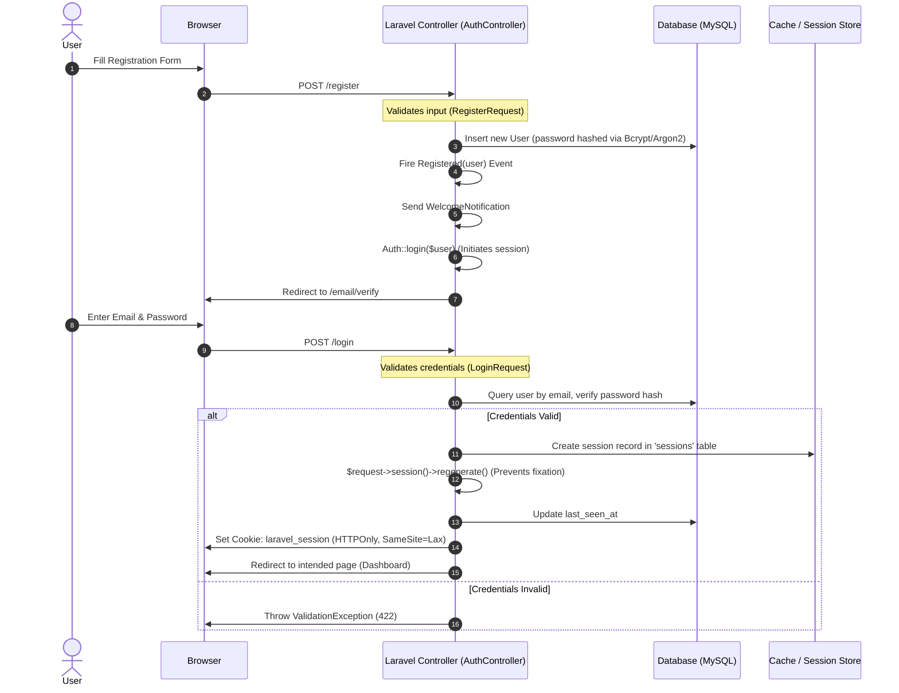
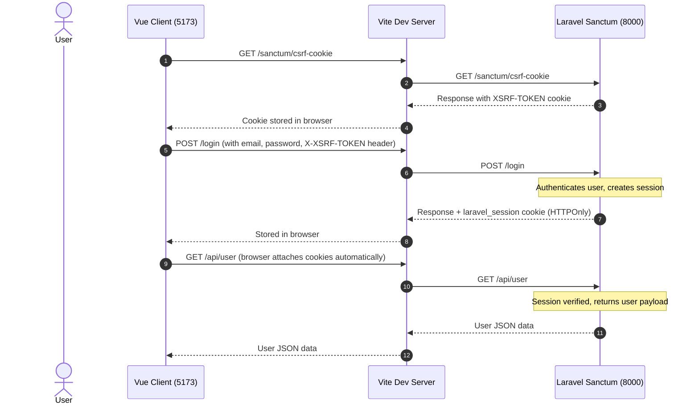
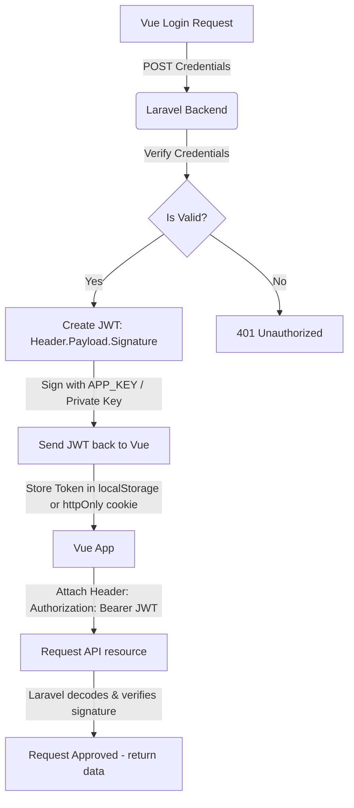
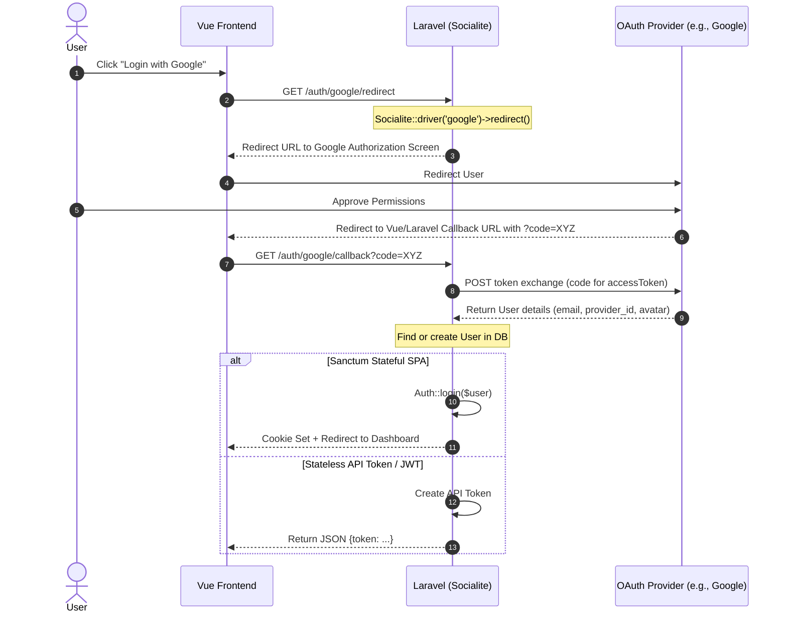

# Blog Platform - Authentication Architecture & Flow Guide

This document provides a comprehensive, end-to-end explanation of the authentication mechanisms in this Laravel project, how they operate currently, how they migrate to a decoupled Vue.js frontend, and how various token and session strategies function.

---

## 1. Current Authentication Flow (Blade + Sessions)

### Registration & Login Sequence


### Key Questions Answered:
* **How is CORS Handled?** 
  In the current architecture, Laravel serves both the frontend (Blade views) and the backend controllers from the **same origin** (domain and port). Because they share the same origin, the browser does not restrict cross-origin requests, and CORS (Cross-Origin Resource Sharing) is not active or needed.
* **Where is the Session Stored?**
  According to `.env` (`SESSION_DRIVER=database`), sessions are stored in the database. When a user logs in, Laravel writes a session record containing the user's ID, IP address, user-agent, and payload data into the **`sessions`** table. The browser receives a cookie named `laravel-session` containing a cryptographically signed session ID. For subsequent requests, the browser sends this cookie, and Laravel reads the session record from the database to identify the authenticated user.
* **How are Remember Tokens Handled?**
  When "Remember Me" is checked:
  1. Laravel generates a secure random string (60 characters).
  2. It saves it in the `remember_token` column of the `users` table.
  3. It sets a persistent cookie named `remember_web_xxxx` containing the user ID, the raw remember token, and a secure hash signature. 
  4. If the session expires, Laravel reads this cookie, validates the token against the database record, and logs the user back in.
* **How are Password Reset Tokens Handled?**
  1. The user requests a reset link.
  2. Laravel generates a secure token and saves its SHA-256 hash in the `password_reset_tokens` table along with the email and creation timestamp (`created_at`).
  3. The plaintext token is emailed to the user.
  4. When clicked, Laravel hashes the incoming token and matches it against the database table. If valid and not expired, the password is reset.

---

## 2. Decoupled Frontend (Vue.js) Integration

If you rewrite the frontend in Vue.js, the architecture changes to a client-server structure where the Vue app runs on one port (e.g., `http://localhost:5173`) and the Laravel API runs on another (e.g., `http://localhost:8000`).

### Dev Environment Proxy Config
To bypass CORS issues during development, you configure a reverse proxy in Vite (`vite.config.js`). The browser sends requests to Vite (`5173`), and Vite proxies them to Laravel (`8000`) in the backend:

```javascript
// vite.config.js
import { defineConfig } from 'vite';
import vue from '@vitejs/plugin-vue';

export default defineConfig({
  plugins: [vue()],
  server: {
    proxy: {
      '/api': {
        target: 'http://localhost:8000',
        changeOrigin: true,
        headers: {
          Accept: 'application/json',
          'X-Requested-With': 'XMLHttpRequest',
        }
      },
      '/sanctum': {
        target: 'http://localhost:8000',
        changeOrigin: true
      }
    }
  }
});
```

### Production CORS Handling
In production, if they are served from different domains (e.g., `app.mywebsite.com` and `api.mywebsite.com`), Laravel's CORS middleware must be configured in `config/cors.php`:
```php
return [
    'paths' => ['api/*', 'sanctum/csrf-cookie', 'login', 'logout', 'register'],
    'allowed_methods' => ['*'],
    'allowed_origins' => ['https://app.mywebsite.com'], // Vue application origin
    'allowed_headers' => ['*'],
    'exposed_headers' => [],
    'max_age' => 0,
    'supports_credentials' => true, // CRITICAL: Required for session-based cookie authentication
];
```

---

## 3. Stateful vs. Stateless API Authentication

### Option A: Stateful Cookie-Based Authentication (Laravel Sanctum - Recommended)
This approach treats the SPA (Vue) and the API as a single entity, sharing a session cookie.



* **CORS Settings**: Must enable `'supports_credentials' => true` in Laravel.
* **Security**: Best protection against token theft. Browsers store the cookies with `HttpOnly` and `Secure` flags, meaning JavaScript code cannot read or steal the session token (immune to XSS). It is secured against CSRF via the `X-XSRF-TOKEN` token header check.

---

### Option B: Stateless Token-Based Authentication (Laravel Sanctum Tokens)
Used when the Vue client is fully decoupled (e.g., hosted on different servers without shared domains).

1. **Authentication**: Vue posts user credentials to `/api/login`.
2. **Issue Token**: Laravel validates credentials and generates a plain-text API token:
   ```php
   $token = $user->createToken('auth_token')->plainTextToken;
   return response()->json(['access_token' => $token, 'token_type' => 'Bearer']);
   ```
3. **Database Storage**: The SHA-256 hashed version of the token is saved in the `personal_access_tokens` table.
4. **Client-side Storage**: The Vue client stores the plain-text token (usually in `localStorage`, `sessionStorage`, or in-memory state).
5. **Authorization Header**: For subsequent requests, the Vue client attaches the token in the headers:
   `Authorization: Bearer <plainTextToken>`.

---

### Option C: Stateless JWT (JSON Web Tokens)
Instead of querying a database table on every request (like Sanctum tokens), the backend signs a JSON token containing user details and sends it to the client.



* **Where is the Token Stored?**
  * **Option 1 (Common but less secure)**: `localStorage`. Vulnerable to Cross-Site Scripting (XSS).
  * **Option 2 (Highly Secure)**: An `HttpOnly`, `Secure`, `SameSite=Strict` cookie set by the backend.
* **Stateless Validation**: Laravel doesn't query the DB to check if the token exists. It simply verifies the signature using the server's `APP_KEY`. If signature matches, it trusts the payload contents (e.g. `user_id`).
* **Token Blacklisting**: If a user logs out, the JWT is still cryptographically valid until it expires. To revoke it, Laravel must store the blacklisted token ID in the **Cache (Redis/Memcached)** with a TTL matching the token's remaining lifetime. On every request, Laravel checks the cache. If the token ID is in the cache, the request is rejected.

---

## 4. Social Login Integration (OAuth 2.0 / Laravel Socialite)

To support login via Google, GitHub, or Facebook:



### Backend Database Logic for Social Login
In your `users` table migration, you add fields to associate providers:
```php
Schema::table('users', function (Blueprint $table) {
    $table->string('provider_name')->nullable(); // e.g., 'google', 'github'
    $table->string('provider_id')->nullable();   // unique ID from provider
});
```

And in the callback controller:
```php
public function handleProviderCallback($provider)
{
    $socialUser = Socialite::driver($provider)->user();

    // Find user by provider ID or email
    $user = User::where('provider_name', $provider)
                ->where('provider_id', $socialUser->getId())
                ->first();

    if (!$user) {
        // Fallback search by email
        $user = User::where('email', $socialUser->getEmail())->first();

        if ($user) {
            // Bind social account to existing user
            $user->update([
                'provider_name' => $provider,
                'provider_id' => $socialUser->getId(),
            ]);
        } else {
            // Register new user
            $user = User::create([
                'name' => $socialUser->getName() ?? $socialUser->getNickname(),
                'email' => $socialUser->getEmail(),
                'password' => Hash::make(Str::random(24)), // Random password
                'provider_name' => $provider,
                'provider_id' => $socialUser->getId(),
                'email_verified_at' => now(), // OAuth users verified by provider
            ]);
        }
    }

    // Authenticate and return response
    Auth::login($user);
    
    // Return token or cookie response depending on chosen architecture
}
```
