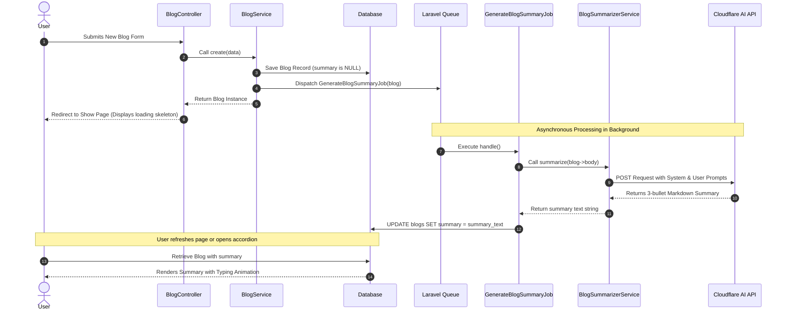

# Backend Architecture & Blog Summarization Flow Guide

This guide is designed for backend and full-stack developers to understand how the backend of the **InkPress** blog application functions, focusing specifically on the end-to-end flow of blog post creation, queue-based AI summary generation, caching strategies, and database seeding.

---

## 1. Backend Architecture Overview

InkPress uses a clean service-oriented Laravel architecture to decouple business logic from HTTP entrypoints:

```
[ HTTP Requests / Web Routing ]
            │
            ▼
   [ BlogController ]
            │
            ▼
     [ BlogService ] (Handles business logic & dispatches background jobs)
      /           \
     /             \
    ▼               ▼
[ BlogRepository ]  [ GenerateBlogSummaryJob ] (Queued Job)
    │                       │
    ▼                       ▼
[ Database ]      [ BlogSummarizerService ] ──► [ Cloudflare Workers AI API ]
```

- **Controllers**: Handle parameter validation and return Blade views or JSON responses.
- **Service Layer (`BlogService`)**: Executes core actions (creating, updating, deleting), manages cache invalidation, and dispatches background operations.
- **Repository Layer (`BlogRepositoryInterface`)**: Direct database access through Eloquent queries.
- **Queued Jobs (`GenerateBlogSummaryJob`)**: Executes CPU/network-intensive tasks (like calling the AI service) asynchronously.
- **AI Services (`BlogSummarizerService`)**: Wraps API calls to external services with local fallback logic.

---

## 2. End-to-End AI Blog Summarization Pipeline

When a user creates a new story, a summaries pipeline triggers:



### Detailed Component Analysis

#### 1. Dispatching the Job (`app/Services/BlogService.php`)
When a blog is created or updated, `BlogService` dispatches the summary generation job:
```php
public function create(array $data): Blog
{
    $payload = $this->hydratePayload($data);
    $this->clearCache();
    $blog = $this->blogs->create($payload);

    // Dispatch the summary job to the queue
    \App\Jobs\GenerateBlogSummaryJob::dispatch($blog);

    return $blog;
}
```

#### 2. The Asynchronous Job (`app/Jobs/GenerateBlogSummaryJob.php`)
The job implements `ShouldQueue` so that the web worker does not hang waiting for third-party AI HTTP responses:
```php
class GenerateBlogSummaryJob implements ShouldQueue
{
    use Queueable;

    public function __construct(public \App\Models\Blog $blog) {}

    public function handle(\App\Services\BlogSummarizerService $summarizer): void
    {
        // 1. Generate summary from post body
        $summary = $summarizer->summarize($this->blog->body);

        // 2. Update the blog record in the database
        $this->blog->update([
            'summary' => $summary,
        ]);
    }
}
```

#### 3. Summarization Service & Cloudflare Workers AI (`app/Services/BlogSummarizerService.php`)
The summarizer calls Cloudflare Workers AI using the **Llama 3.8b Instruct** model:
- **API URL**: `https://api.cloudflare.com/client/v4/accounts/{account_id}/ai/run/{model}`
- **System Prompt**: Enforces outputting exactly 3 bullet points starting with `-` without preambles or greetings:
  > *"You are a professional blog post summarizer. Generate a concise, high-quality summary of the post in exactly 3 clear bullet points (each starting with a dash "-"). Do not include any greeting, introduction, or signature, just the 3 bullet points."*
- **User Prompt**: Sends the stripped, text-only body content (truncated to a maximum of 4000 characters to conserve prompt size limit).

```php
$response = Http::withToken($apiToken)
    ->timeout(15)
    ->post("https://api.cloudflare.com/client/v4/accounts/{$accountId}/ai/run/{$model}", [
        'messages' => [
            ['role' => 'system', 'content' => $systemPrompt],
            ['role' => 'user', 'content' => "Summarize this blog post:\n\n" . Str::limit($text, 4000)]
        ]
    ]);
```

#### 4. Bulletproof Local Fallback Execution
If the Cloudflare Workers AI API is unreachable, or if credentials are missing in the local environment, the service falls back gracefully to a regex-based linguistic analyzer to build the summary:
- Splitting: Uses `preg_split('/(?<=[.!?])\s+/', $text)` to isolate individual sentences.
- Extraction: Selects the first three sentences with length > 15 characters, sanitizes multi-line spaces, and joins them with bullet notation.
- If less than 3 sentences exist, it slices the blog into word segments of 15 words each to formulate 3 fallback bullet points.
```php
private function generateLocalFallbackSummary(string $text): string
{
    $sentences = preg_split('/(?<=[.!?])\s+/', $text);
    // filter short blocks
    $sentences = array_filter(array_map('trim', $sentences), function($sentence) {
        return strlen($sentence) > 15;
    });
    
    $bullets = array_slice($sentences, 0, 3);
    return "- " . implode("\n- ", $bullets);
}
```

---

## 3. Database Seeder Handling (Synchronous Generation)

During database seeding, Laravel runs seeders under Eloquent's `WithoutModelEvents` trait. Because of this, model listeners and standard job dispatching inside the service layer are bypassed. 

To ensure the seed database contains summaries ready to render out of the box, `BlogFactory` resolves the summarizer service out of the container and processes the summary **synchronously** during factory compilation:

```php
public function definition(): array
{
    $body = '<p>'.implode('</p><p>', [fake()->realText(400), fake()->realText(600), fake()->realText(500)]).'</p>';
    
    // Resolve summarizer synchronously for seed database integrity
    $summary = app(\App\Services\BlogSummarizerService::class)->summarize($body);

    return [
        'title' => $title,
        'body' => $body,
        'summary' => $summary, // seeded directly
        // ...
    ];
}
```

---

## 4. Cache Management Strategy

To ensure high performance, InkPress caches blog pages. The caching must be invalidated immediately when database updates occur.

### Tagged Cache Invalidation & Fallback
The `BlogService` manages cache invalidation using `Cache::tags`:
```php
private function clearCache(): void
{
    try {
        // Clear cached blogs by tag
        Cache::tags(['blogs'])->flush();
    } catch (\BadMethodCallException $e) {
        // Fallback for cache drivers that do not support tags (e.g., 'file', 'database')
        Cache::flush();
    }
}
```
This ensures that whether a production database runs Redis (which supports tags) or local development runs file cache, invalidation operates cleanly without throwing fatal configuration exceptions.
