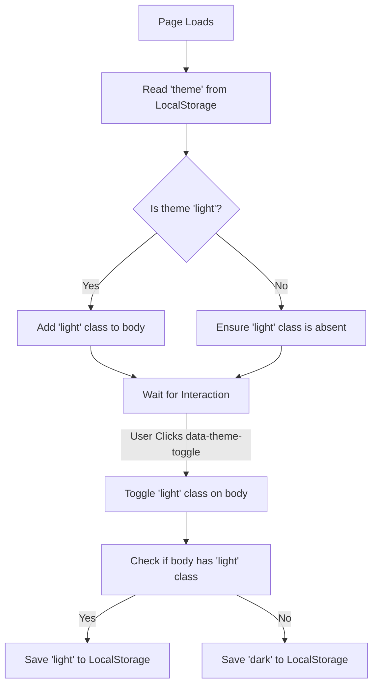

# Frontend Architecture & Implementation Guide

This guide is designed for backend developers to understand how the frontend of the **InkPress** blog application is built, styled, and interactive. It documents the core frontend stack, CSS design systems, dynamic behaviors, and interactive mechanisms.

---

## 1. Frontend Technology Stack

The frontend is built with a lightweight, modern stack that avoids complex client-side frameworks while remaining dynamic:

| Technology | Purpose | Key Integration Details |
| :--- | :--- | :--- |
| **Laravel Blade** | Templating & HTML Structure | Layouts are located in `resources/views/layouts/` and views in `resources/views/`. |
| **Tailwind CSS 4.0** | Modern Styling & Grid System | Configured in `resources/css/app.css` using the new `@theme` and `@import 'tailwindcss'` directives. |
| **Vanilla JavaScript** | DOM Manipulation & Client Logic | Single entrypoint in `resources/js/app.js`, bundled via Vite and loaded as a module in the main layout. |
| **Google Fonts** | Premium Typography | *Playfair Display* (for headings) and *Plus Jakarta Sans* (for body text). |

---

## 2. End-to-End Theme Switching System (Light/Dark Mode)

InkPress features a premium dark theme by default, with a toggle to switch to a polished, high-contrast light theme.

### CSS Theme Architecture (`resources/css/app.css`)
Theme variables and root configurations are set inside the Tailwind `@theme` block:
```css
@theme {
    --font-sans: 'Plus Jakarta Sans', ui-sans-serif, system-ui, sans-serif;
    --font-serif: 'Playfair Display', Georgia, serif;
    --color-ink-50: #f8fafc;
    /* ... */
}
```

- **Default (Dark Mode)**: Applied to the base `body` element.
  ```css
  body {
      @apply bg-slate-950 text-slate-100;
      background-image:
          radial-gradient(circle at top left, rgba(249, 115, 22, 0.18), transparent 30%),
          radial-gradient(circle at top right, rgba(14, 165, 233, 0.12), transparent 25%),
          linear-gradient(180deg, #020617 0%, #0f172a 100%);
  }
  ```
- **Light Mode (`body.light`)**: Active when the `.light` class is appended to the `<body>` element.
  ```css
  body.light {
      @apply bg-slate-50 text-slate-900;
      background-image:
          radial-gradient(circle at top left, rgba(249, 115, 22, 0.12), transparent 32%),
          radial-gradient(circle at top right, rgba(15, 118, 110, 0.1), transparent 25%),
          linear-gradient(180deg, #fffcf9 0%, #fcfdfd 100%);
  }
  ```

#### Contrast Correction & Color Mapping overrides:
Since the HTML templates utilize dark-centric Tailwind utility classes (e.g. `text-slate-400`, `border-white/10`), we use explicit CSS selectors under `body.light` with `!important` to enforce crisp contrast on the fly without changing HTML markup:
```css
body.light .text-slate-400 { color: #475569 !important; }
body.light .text-slate-300 { color: #334155 !important; }
body.light .text-slate-200 { color: #1e293b !important; }
body.light .text-slate-100 { color: #0f172a !important; }
body.light .border-white\/10 { border-color: rgba(15, 23, 42, 0.08) !important; }
body.light .border-white\/15 { border-color: rgba(15, 23, 42, 0.12) !important; }
body.light .bg-white\/6      { background-color: rgba(15, 23, 42, 0.04) !important; }
body.light .bg-white\/8      { background-color: rgba(15, 23, 42, 0.05) !important; }
```

### The Theme Toggle Button (`layouts/app.blade.php` & `layouts/dashboard.blade.php`)
The theme switch is triggerable via a square button labeled with the `data-theme-toggle` attribute:
```html
<button data-theme-toggle class="btn-theme-toggle" aria-label="Toggle theme">
    <!-- Sun icon for dark mode -->
    <svg class="sun-icon ...">...</svg>
    <!-- Moon icon for light mode -->
    <svg class="moon-icon ...">...</svg>
</button>
```

#### SVG Icon Toggle Logic (Pure CSS)
The visibility of the Sun/Moon icons inside the button is controlled declaratively in CSS, depending on the presence of the `body.light` class:
```css
.btn-theme-toggle .sun-icon { display: block; }
.btn-theme-toggle .moon-icon { display: none; }

body.light .btn-theme-toggle .sun-icon { display: none; }
body.light .btn-theme-toggle .moon-icon { display: block; }
```

### Javascript Initialization & Interaction (`resources/js/app.js`)
On page load and click events, JavaScript synchronizes the DOM class with `localStorage`:



```javascript
// 1. Initial configuration on load
const theme = localStorage.getItem('theme') || 'dark';
document.body.classList.toggle('light', theme === 'light');

// 2. Global listener for click events
document.addEventListener('click', (event) => {
    if (event.target.closest('[data-theme-toggle]')) {
        const isLight = document.body.classList.toggle('light');
        localStorage.setItem('theme', isLight ? 'light' : 'dark');
    }
});
```

---

## 3. AI Summary Accordion & Typing Animation

When viewing a blog post (`blogs/show.blade.php`), a dynamic summary box appears. 

### HTML Structure
```html
<details class="summary-accordion group mt-8 ...">
    <summary class="flex cursor-pointer items-center justify-between p-6 ...">
        <span>Quick AI Summary</span>
        <svg class="transition-transform duration-300 group-open:rotate-180 ...">...</svg>
    </summary>
    <div class="border-t ...">
        @if($blog->summary)
            <div class="summary-content" data-summary="{{ $blog->summary }}">
                <!-- Server-Side Fallback for Non-JS / Search Indexers -->
                {!! Str::markdown($blog->summary) !!}
            </div>
        @else
            <!-- Skeleton Loader when Job is still processing -->
            <div class="flex flex-col gap-3 py-2">
                <div class="animate-pulse">AI is generating the summary...</div>
                <div class="skeleton-line h-3 w-11/12 rounded bg-white/5"></div>
                <div class="skeleton-line h-3 w-10/12 rounded bg-white/5"></div>
            </div>
        @endif
    </div>
</details>
```

### Typewriter Effect Execution Flow
Instead of loading static HTML instantly, the text is animated to look like the AI is summarizing the content in real time:

1. **Clear SSR Content**:
   On page load, if a summary is present, JS immediately clears the pre-rendered HTML content of the `.summary-content` div, so that the accordion starts empty when opened.
   ```javascript
   const accordion = document.querySelector('.summary-accordion');
   const contentDiv = accordion.querySelector('.summary-content');
   const rawSummary = contentDiv.dataset.summary;
   
   // Clear initial SSR content before visual display
   contentDiv.innerHTML = '';
   ```
2. **Detect Expansion**:
   Listen to the HTML `<details>` element's standard `toggle` event. Once `accordion.open` is true, trigger the typist script.
   ```javascript
   let hasTyped = false;
   accordion.addEventListener('toggle', () => {
       if (accordion.open && !hasTyped) {
           hasTyped = true;
           typeSummary(contentDiv, rawSummary);
       }
   });
   ```
3. **Parse & Render Character-by-Character**:
   The script splits the markdown list format (`- Bullet point text`) by newlines, extracts each line, and formats them into a styled HTML bullet list (`<ul>` and `<li>`), typing each character at a speed of 8ms.
   ```javascript
   function typeSummary(container, text) {
       container.innerHTML = '';
       const lines = text.split('\n')
           .map(line => line.trim())
           .filter(line => line.startsWith('-') || line.startsWith('*'));

       const ul = document.createElement('ul');
       ul.className = 'list-disc pl-5 space-y-2.5';
       container.appendChild(ul);

       let lineIndex = 0;
       function typeNextLine() {
           if (lineIndex >= lines.length) return;

           const li = document.createElement('li');
           li.className = 'marker:text-orange-500';
           ul.appendChild(li);

           // Remove leading dash/asterisk from the raw string
           const rawLine = lines[lineIndex].replace(/^[-*]\s*/, '');
           let charIndex = 0;

           function typeChar() {
               if (charIndex < rawLine.length) {
                   li.innerHTML += rawLine.charAt(charIndex);
                   charIndex++;
                   setTimeout(typeChar, 8); // 8ms letter insertion interval
               } else {
                   lineIndex++;
                   typeNextLine();
               }
           }
           typeChar();
       }
       typeNextLine();
   }
   ```

---

## 4. Other Dynamic Frontend Behaviors

### A. AJAX Likes & Bookmarks
Actions (liking or bookmarking a post) do not reload the page. A global listener catches clicks on interactive endpoints:
- **Selectors**: `[data-like-button]`, `[data-bookmark-button]`
- **Behavior**:
  - Halts standard action (`preventDefault`).
  - Fetches backend POST route parsed from the element's `data-endpoint` attribute.
  - Sends CSRF Token read from `<meta name="csrf-token">`.
  - Increments/decrements numbers inside the inner `[data-count]` tag.
  - Toggles the styling active states (e.g. `bg-orange-500` and `text-white`).

### B. Instant File Uploads
For elements like profile pictures or media attachments:
- **Selector**: `[data-media-upload]`
- **Behavior**: Detects `change` on the file input, automatically builds a `FormData` object with the parent form, submits it asynchronously via `fetch`, and displays a toast before reloading the page.

### C. Debounced Search Autocomplete
Prevents hitting the database on every keystroke:
- **Selector**: `[data-search-input]`
- **Behavior**:
  - Listens to key presses.
  - Clears previous timer using `clearTimeout(searchTimer)`.
  - Sets a 300ms `setTimeout` to call the backend endpoint `/search/suggestions?q=...`.
  - Appends suggestions inside the target selector defined by the input's `data-target` attribute.

### D. Toast Notification System
Floating error/success indicators located in the bottom-right/top-right corners:
- **Selector**: `[data-toast-root]`
- **Trigger**: Script calls `window.showToast(message, type)` or processes backend flash data specified under `[data-flash]`.
- **Implementation**: Dynamically creates a `div` element with visual borders (`border-emerald-400/30` for success or `border-red-400/30` for error), appends it to the root element, and automatically destroys the element using `setTimeout` after 3.5 seconds.
