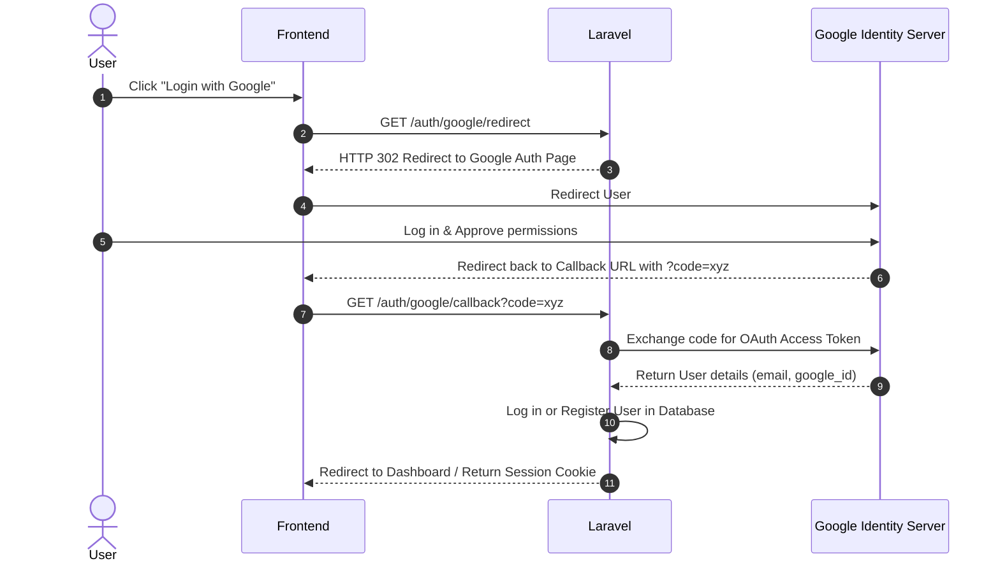
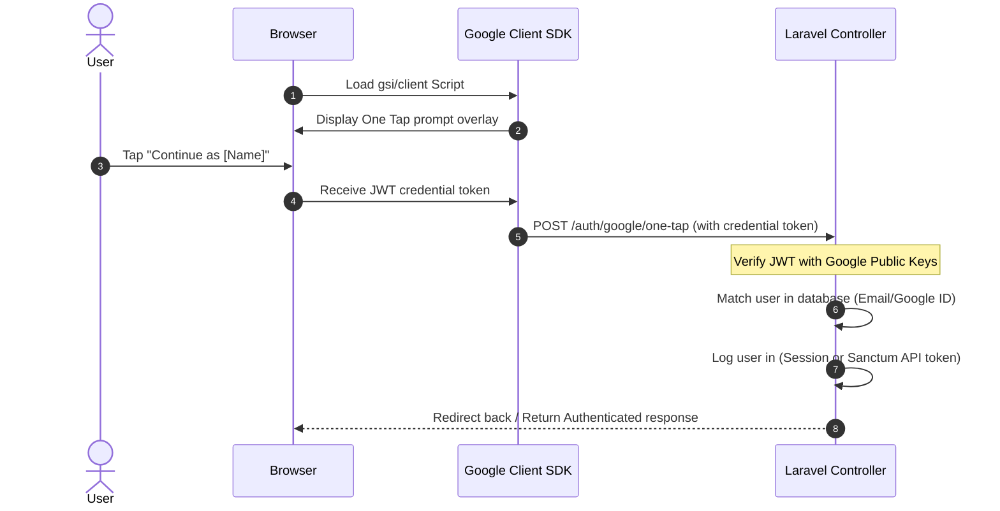

# Implementation Guide: OAuth & Google One Tap Login

This guide details the step-by-step implementation of standard **OAuth Social Login** (via Laravel Socialite) and the floating **Google One Tap login** prompt in this project.

---

## 1. Standard OAuth Login (Laravel Socialite)

Standard Social Login redirects the user to the provider (e.g., Google or GitHub) and handles their credentials on approval.



### Step 1: Install Laravel Socialite
Run the following command to install the official Socialite package:
```bash
composer require laravel/socialite
```

### Step 2: Database Migration
Generate a migration to add social login fields to the `users` table:
```bash
php artisan make:migration add_oauth_fields_to_users_table --table=users
```

Configure the migration:
```php
public function up(): void
{
    Schema::table('users', function (Blueprint $table) {
        $table->string('provider_name')->nullable()->after('password');
        $table->string('provider_id')->nullable()->after('provider_name');
        
        // Make password nullable for pure OAuth users
        $table->string('password')->nullable()->change();
    });
}
```

### Step 3: Configure Services
Add OAuth credentials inside `config/services.php`:
```php
'google' => [
    'client_id' => env('GOOGLE_CLIENT_ID'),
    'client_secret' => env('GOOGLE_CLIENT_SECRET'),
    'redirect' => env('GOOGLE_REDIRECT_URI'), // e.g. http://localhost:8000/auth/google/callback
],
```

Add these corresponding credentials to your `.env` file.

### Step 4: Routing & Controller
Create the routes in `routes/web.php`:
```php
use App\Http\Controllers\Auth\SocialAuthController;

Route::get('/auth/{provider}/redirect', [SocialAuthController::class, 'redirectToProvider'])->name('auth.redirect');
Route::get('/auth/{provider}/callback', [SocialAuthController::class, 'handleProviderCallback'])->name('auth.callback');
```

Create the controller `app/Http/Controllers/Auth/SocialAuthController.php`:
```php
<?php

namespace App\Http\Controllers\Auth;

use App\Http\Controllers\Controller;
use App\Models\User;
use Illuminate\Support\Facades\Auth;
use Illuminate\Support\Facades\Hash;
use Illuminate\Support\Str;
use Laravel\Socialite\Facades\Socialite;

class SocialAuthController extends Controller
{
    public function redirectToProvider($provider)
    {
        return Socialite::driver($provider)->redirect();
    }

    public function handleProviderCallback($provider)
    {
        try {
            $socialUser = Socialite::driver($provider)->user();
        } catch (\Exception $e) {
            return redirect()->route('login')->withErrors(['email' => 'Social login failed.']);
        }

        // 1. Check if user already logged in with this social account
        $user = User::where('provider_name', $provider)
                    ->where('provider_id', $socialUser->getId())
                    ->first();

        if (!$user) {
            // 2. Check if a user exists with the same email
            $user = User::where('email', $socialUser->getEmail())->first();

            if ($user) {
                // Bind OAuth to existing account
                $user->update([
                    'provider_name' => $provider,
                    'provider_id' => $socialUser->getId(),
                ]);
            } else {
                // 3. Register new user
                $user = User::create([
                    'name' => $socialUser->getName() ?? $socialUser->getNickname(),
                    'email' => $socialUser->getEmail(),
                    'password' => Hash::make(Str::random(24)),
                    'provider_name' => $provider,
                    'provider_id' => $socialUser->getId(),
                    'email_verified_at' => now(),
                ]);
            }
        }

        Auth::login($user);
        request()->session()->regenerate();

        return redirect()->intended(route('dashboard.index'));
    }
}
```

---

## 2. Google One Tap Login

Google One Tap shows a prompt inviting users to sign in with their Google Account on your pages without redirecting them.



### Step 1: Install Google API Client library
To securely verify the Google ID token sent by One Tap on the backend, install the Google API client library:
```bash
composer require google/apiclient
```

### Step 2: Include Frontend Prompt
Google One Tap uses an HTML/JS SDK. Add this script tag inside the `<head>` of your main Blade layout (or Vue entry):
```html
<script src="https://accounts.google.com/gsi/client" async defer></script>
```

Add the target container prompt to your login page. Google's SDK will detect this code and launch the float-up prompt automatically:
```html
<!-- Google One Tap config -->
<div id="g_id_onload"
     data-client_id="YOUR_GOOGLE_CLIENT_ID"
     data-context="signin"
     data-ux_mode="redirect"
     data-login_uri="http://localhost:8000/auth/google/one-tap"
     data-auto_select="true"
     data-itp_support="true">
</div>
```
> [!NOTE]
> - `data-client_id`: Your Google Cloud Console Client ID.
> - `data-ux_mode="redirect"`: Instructs Google to POST the ID Token to your backend callback URL automatically when clicked.
> - `data-login_uri`: The Laravel endpoint that will receive Google's POST payload.

---

### Step 3: Handle One Tap Payload on Backend

When the user taps the prompt, Google sends an HTTP POST request to the `data-login_uri` with a form field named `credential` (which is a cryptographically signed ID Token).

#### 1. Disable CSRF for Google's callback
Because Google makes a direct cross-origin POST request to your backend, Laravel's CSRF token check will block it. You must exclude this route from CSRF checking:

In Laravel 11 (`bootstrap/app.php`):
```php
->withMiddleware(function (Middleware $middleware) {
    $middleware->validateCsrfTokens(except: [
        'auth/google/one-tap',
    ]);
})
```

#### 2. Define the Callback Route (`routes/web.php`):
```php
Route::post('/auth/google/one-tap', [SocialAuthController::class, 'handleOneTap'])->name('auth.google.onetap');
```

#### 3. Controller Token Verification Logic:
Inside `SocialAuthController.php`, add the `handleOneTap` method:
```php
use Google_Client;

public function handleOneTap(\Illuminate\Http\Request $request)
{
    $credential = $request->input('credential');

    if (!$credential) {
        return redirect()->route('login')->withErrors(['email' => 'Google One Tap authentication failed.']);
    }

    // Initialize Google API Client with Client ID
    $client = new Google_Client(['client_id' => env('GOOGLE_CLIENT_ID')]);

    // Verify token validity against Google certificates
    $payload = $client->verifyIdToken($credential);

    if (!$payload) {
        return redirect()->route('login')->withErrors(['email' => 'Invalid Google credential token.']);
    }

    // Google returns user info in the token payload
    $googleId = $payload['sub']; // Unique Google account ID
    $email = $payload['email'];
    $name = $payload['name'];

    // Find or create User
    $user = User::where('provider_name', 'google')
                ->where('provider_id', $googleId)
                ->first();

    if (!$user) {
        $user = User::where('email', $email)->first();

        if ($user) {
            $user->update([
                'provider_name' => 'google',
                'provider_id' => $googleId,
            ]);
        } else {
            $user = User::create([
                'name' => $name,
                'email' => $email,
                'password' => Hash::make(Str::random(24)),
                'provider_name' => 'google',
                'provider_id' => $googleId,
                'email_verified_at' => now(),
            ]);
        }
    }

    // Log the user into Laravel
    Auth::login($user);
    $request->session()->regenerate();

    return redirect()->intended(route('dashboard.index'));
}
```
---

## Summary Checklist for Social Features
- [ ] Create Google Cloud Console project.
- [ ] Set up **OAuth Consent Screen** (User type: External).
- [ ] Create **OAuth 2.0 Client ID** (Web application).
- [ ] Set Authorized JavaScript Origins (`http://localhost:8000` / `http://localhost:5173`).
- [ ] Set Authorized Redirect URIs (`http://localhost:8000/auth/google/callback` and `http://localhost:8000/auth/google/one-tap`).
- [ ] Add `GOOGLE_CLIENT_ID` and `GOOGLE_CLIENT_SECRET` to `.env`.
- [ ] Run migration to add provider columns to database.
- [ ] Test standard redirect and one-tap popups.
